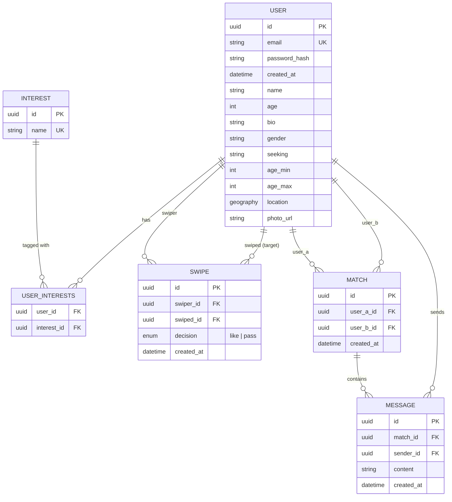

# Kpinder — Spec

Dating service MVP. Monorepo: `backend/` (Python, FastAPI) + `frontend/` (React, TypeScript, Vite).

## 1. Components

Backend is organized as **vertical slices** — one bounded context per feature, not horizontal layers spanning the whole app. A slice owns its router, service, repository, and (where applicable) its own tables. Slices never import another slice's router or service.

| Slice | Owns | Depends on |
|---|---|---|
| `auth` | login, registration, JWT issuance, profile management, photo upload | `shared` |
| `matching` | candidate ranking, swipe, match detection | `shared` |
| `chat` | 1:1 messaging over WebSocket | `shared` |

`shared/` (core) is not a slice — it's infrastructure every slice depends on, and never the other way around:
- DB session factory
- JWT-verify dependency (identifies the current user for any slice's router)
- WebSocket connection registry (`user_id → connection`, in-memory, single-process)
- Core data models: `User`, `Interest`, `UserInterests`

A slice's own repository may read `shared`'s tables directly (e.g. `matching` reads `User`/`Interest` for candidate ranking) — that's reading shared data, not calling another slice's business logic, so it doesn't violate the no-cross-slice-import rule.

### Internal layering (per slice)

```
router.py       — HTTP/WS endpoints, Pydantic schemas
service.py       — business rules (scoring, match detection, event emission)
repository.py    — SQLAlchemy queries only, no business logic
models.py        — slice-owned tables (reads shared models directly where needed)
tests/           — unit tests (repository mocked) + integration tests (real DB)
```

### Cross-slice communication

There is no event bus and no message broker. `matching` and `chat` are the only slices with anything to push live, and each does so directly over the shared WS registry to the other user involved — `chat` pushes a new message (and its read receipt) to the other side of the conversation. Nothing is persisted and nothing is delivered after the fact: an offline user simply sees the new match/message next time they open the matches list or chat. A dedicated `notifications` slice, a Redis pub/sub event bus (`match.created`/`message.sent`), and a candidate-list cache were all designed and then deliberately cut from this MVP — see `ai/audit.md` and `standards/adr/0003-redis-event-bus.md` for why, and what would need to change to bring them back.

## 2. Data model



Notes:
- `SWIPE` has a unique constraint on `(swiper_id, swiped_id)` and records both `like` and `pass`, so a passed profile never resurfaces in a future candidate list.
- `MATCH` is created the moment a reciprocal `like` is detected (both directions exist in `SWIPE`).
- Location is stored as a PostGIS `geography(Point)` column; candidate queries filter with `ST_DWithin`.
- Interests are a curated, predefined tag list (not free text) so Jaccard overlap is meaningful — free text would make "hiking" and "hikeing" score as zero overlap.

## 3. Key scenarios — how data updates

### Registration & login (`auth`)
1. `POST /auth/register` — validates input, hashes password, inserts a `User` row.
2. `POST /auth/login` — verifies credentials, issues a JWT (single long-lived access token, no refresh rotation for MVP).
3. All other slices' routers depend on the shared JWT-verify dependency to identify the caller — none re-implement auth.

### Profile management & photo upload (`auth`)
1. `PATCH /auth/profile` — updates `User` fields (bio, interests, location, gender/seeking, age range) directly.
2. `POST /auth/profile/photo` — validates content-type/magic bytes and size, writes to a local disk volume under a randomized UUID filename, stores the resulting `photo_url` on `User`.

### Swipe & match (`matching`)
1. `GET /matching/candidates` — queries `User` filtered by PostGIS radius + gender/seeking + age range, excluding users already present in `SWIPE`, ranks the rest by Jaccard interest overlap.
2. `POST /matching/swipe` — inserts a `SWIPE` row (`like` or `pass`). If a reciprocal `like` already exists for the pair, creates a `MATCH` row and pushes a live "match" update directly to both users over the shared WS registry, if connected.

### Messaging (`chat`)
1. Client opens a WebSocket authenticated via the shared JWT dependency; `chat` registers the connection in the shared WS registry.
2. `send_message` over the socket — validates the sender is part of the `match`, inserts a `Message`, and pushes it directly to the recipient's connection if registered. If the recipient isn't connected, they see it next time they open the chat.

## 4. Scoped out (documented, not built)

- Frontend tests (Vitest/RTL) — backend-only test coverage for this lab.
- JWT refresh-token rotation — single long-lived access token.
- Multi-instance WebSocket scaling — connection registry is single-process.
- Rate limiting / abuse prevention.
- `notifications` slice, persisted/offline notifications, and any event bus or message broker (Redis or otherwise) — `matching`/`chat` push live over the shared WS registry only; nothing is queued, persisted, or delivered to an offline user. See `ai/audit.md` for the fuller design this replaced and why it was cut.
- Candidate-list caching — `matching` queries Postgres directly on every request; no cache layer.

## 5. Infra & environments

- **Local**: `docker compose up` — Postgres+PostGIS, backend, frontend.
- **CI**: GitHub Actions — `ruff`/`eslint`+`prettier`, backend unit tests, integration tests (real Postgres+PostGIS via testcontainers), frontend build. All required checks on every PR into `main`.
- **Staging**: Railway, auto-deploys on every merge to `main`.
- **Config**: `pydantic-settings` reads env vars uniformly across local/stage/prod; secrets (DB URL, JWT signing key) are never committed — `.env.example` only.

## 6. Standards

See `standards/` for ADR format (MADR), Definition of Done, and the audit checklist. ADRs are written only for genuinely contested decisions (vertical slices vs layered, shared-core boundary rule, Redis as event bus, WebSockets vs polling, PostGIS vs plain lat/lng, swipe+mutual-match vs auto-match, JWT vs sessions) — not for routine stack picks.

## 7. AI trail

This spec was shaped through an AI-assisted design interview. The full prompt trail is in [`ai/prompts/`](ai/prompts/), and a self-audit of where the AI's suggestions cut corners (and were corrected) is in [`ai/audit.md`](ai/audit.md) — each entry links the originating prompt, the human's correction, and the resulting change to this spec.
