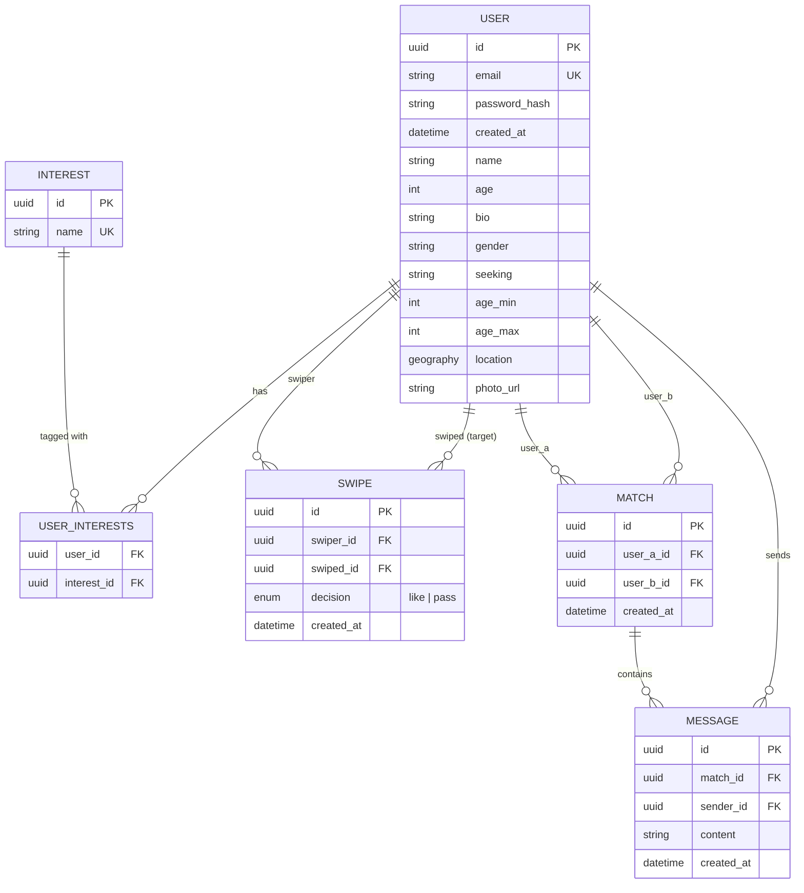

# Kpinder — Spec

Dating service MVP. Monorepo: `backend/` (Python, FastAPI) + `frontend/` (React, TypeScript, Vite).

## 1. Components

Backend is organized as **vertical slices** — one bounded context per feature, not horizontal layers spanning the whole app. A slice owns its router, service, repository, and (where applicable) its own tables. Slices never import another slice's router or service.

| Slice | Owns | Depends on |
|---|---|---|
| `auth` | login, registration, JWT issuance, profile management, photo upload | `shared` |
| `matching` | candidate ranking, swipe, match detection | `shared` |
| `chat` | 1:1 messaging over WebSocket | `shared` |

`shared/` (core) is not a slice — it's infrastructure every slice depends on, and never the other way around:
- DB session factory
- JWT-verify dependency (identifies the current user for any slice's router)
- WebSocket connection registry (`user_id → connection`, in-memory, single-process)
- Core data models: `User`, `Interest`, `UserInterests`

A slice's own repository may read `shared`'s tables directly (e.g. `matching` reads `User`/`Interest` for candidate ranking) — that's reading shared data, not calling another slice's business logic, so it doesn't violate the no-cross-slice-import rule.

### Internal layering (per slice)

```
router.py       — HTTP/WS endpoints, Pydantic schemas
service.py       — business rules (scoring, match detection, event emission)
repository.py    — SQLAlchemy queries only, no business logic
models.py        — slice-owned tables (reads shared models directly where needed)
tests/           — unit tests (repository mocked) + integration tests (real DB)
```

### Cross-slice communication

There is no event bus and no message broker. `matching` and `chat` are the only slices with anything to push live, and each does so directly over the shared WS registry to the other user involved — `chat` pushes a new message (and its read receipt) to the other side of the conversation. Nothing is persisted and nothing is delivered after the fact: an offline user simply sees the new match/message next time they open the matches list or chat. A dedicated `notifications` slice, a Redis pub/sub event bus (`match.created`/`message.sent`), and a candidate-list cache were all designed and then deliberately cut from this MVP — see `ai/audit.md` and `standards/adr/0003-redis-event-bus.md` for why, and what would need to change to bring them back.

## 2. Data model



Notes:
- `SWIPE` has a unique constraint on `(swiper_id, swiped_id)` and records both `like` and `pass`, so a passed profile never resurfaces in a future candidate list.
- `MATCH` is created the moment a reciprocal `like` is detected (both directions exist in `SWIPE`).
- Location is stored as a PostGIS `geography(Point)` column; candidate queries filter with `ST_DWithin`.
- Interests are a curated, predefined tag list (not free text) so Jaccard overlap is meaningful — free text would make "hiking" and "hikeing" score as zero overlap.

## 3. Key scenarios — how data updates

### Registration & login (`auth`)
1. `POST /auth/register` — validates input, hashes password, inserts a `User` row. Concurrent registrations for the same email are handled by inserting and catching the `email` unique-constraint violation — not a check-then-insert — and returning `409 Conflict`. This is the same idiom used for swipe (below) and message dedup: let the DB's unique constraint be the single source of truth for "does this already exist," never a SELECT-then-INSERT with a TOCTOU gap.
2. `POST /auth/login` — verifies credentials, issues a JWT (single long-lived access token, no refresh rotation for MVP).
3. All other slices' routers depend on the shared JWT-verify dependency to identify the caller — none re-implement auth.

### Profile management & photo upload (`auth`)
1. `PATCH /auth/profile` — updates `User` fields (bio, interests, location, gender/seeking, age range) directly.
2. `POST /auth/profile/photo` — validates content-type/magic bytes and size, uploads to Cloudflare R2 under a randomized UUID object key (ADR-0010 — a local disk volume doesn't survive a Railway redeploy), stores the resulting object URL as `photo_url` on `User`.

### Swipe & match (`matching`)
1. `GET /matching/candidates` — a single query: `User` + `UserInterests` eager-loaded via `selectinload` (one batched follow-up query for interests, never one-per-candidate), filtered by PostGIS radius (`ST_DWithin`) + gender/seeking + age range, excluding users already present in `SWIPE` via a `NOT EXISTS` subquery (not a separate "fetch swiped IDs, filter in Python" pass). Ranks the rest by Jaccard interest overlap.
2. `POST /matching/swipe` — inserts a `SWIPE` row (`like` or `pass`) inside one transaction, then checks for a reciprocal `like`; if found, inserts a `MATCH` row in the same transaction and pushes a live "match" update directly to both users over the shared WS registry, if connected.
   - **Append-only, no upsert**: `SWIPE` is never updated or deleted. There is no "unlike"/unmatch scenario — once a `MATCH` exists, it's permanent for this MVP (see §4). A later `POST /matching/swipe` for the same `(swiper_id, swiped_id)` pair with the **same** decision is treated as an idempotent retry: the insert hits the unique constraint, the resulting `IntegrityError` is caught, and the original result (200, including "matched": true/false) is returned rather than propagating a 500. The same request with a **different** decision than what's stored is rejected with `409 Conflict` — a client is never allowed to silently flip a past swipe.
   - **Concurrency**: two users liking each other within milliseconds of each other is the core race. Both transactions insert their own `SWIPE` row, then race to detect the reciprocal `like` and insert `MATCH`. The unique constraint on the normalized `(user_a_id, user_b_id)` pair on `MATCH` (ADR-0006) means only one of the two concurrent inserts succeeds; the loser catches the `IntegrityError` and treats it as "match already exists" (idempotent success, not an error) rather than retrying or failing. This is verified with an integration test that opens two real DB sessions, interleaves their transactions (`asyncio.gather` or two threads) against the real testcontainers Postgres, and asserts exactly one `MATCH` row exists with no unhandled exception on either path — a mocked-`IntegrityError` unit test proves the catch-handler works but not that the real constraint fires correctly under true concurrency, so both are kept, with the integration test as the authoritative check.

### Messaging (`chat`)
1. Client opens a WebSocket authenticated via the shared JWT dependency; `chat` registers the connection in the shared WS registry.
2. `send_message` over the socket — validates the sender is part of the `match`. The client includes a `client_message_id` (UUID, generated per send attempt); `MESSAGE` has a unique constraint on `(match_id, sender_id, client_message_id)`. A resend after a timed-out/un-acked send (same `client_message_id`) hits that constraint and is treated as a no-op — the server re-sends the original ack instead of inserting a duplicate `Message`. On a fresh id, inserts a `Message` and pushes it directly to the recipient's connection if registered. If the recipient isn't connected, they see it next time they open the chat.

### DB/source failure handling (all slices)
A Postgres connection drop or query failure (not a business-logic error like a duplicate email) is not retried automatically inside the request. The SQLAlchemy engine uses `pool_pre_ping` so dead pooled connections are detected and replaced before use rather than surfacing mid-query; a FastAPI exception handler catches `OperationalError`/`DisconnectionError` and returns a generic `503` (never leaking the underlying DB error to the client). There is no message queue to safely replay a side-effecting write, so the client — not the server — decides whether to retry; the idempotency rules above (unique-constraint-backed dedup for register/swipe/message) make any such client-initiated retry safe.

## 4. Scoped out (documented, not built)

- **Static-data prototype phase.** Lab-2's brief calls for implementing scenarios against static/in-memory data first, then swapping in the real DB. This project goes straight to DB integration (SQLAlchemy + Postgres+PostGIS from the start) instead — a deliberate, documented scope cut given the lab's timeline, not an oversight. See `ai/audit.md` Part A.
- **Unmatching / un-liking.** `SWIPE` is append-only (see §3); there is no endpoint or business rule that deletes a `MATCH` once created, and no way to retract a `like`.
- Frontend tests (Vitest/RTL) — backend-only test coverage for this lab.
- JWT refresh-token rotation — single long-lived access token.
- Multi-instance WebSocket scaling — connection registry is single-process.
- Rate limiting / abuse prevention.
- `notifications` slice, persisted/offline notifications, and any event bus or message broker (Redis or otherwise) — `matching`/`chat` push live over the shared WS registry only; nothing is queued, persisted, or delivered to an offline user. See `ai/audit.md` for the fuller design this replaced and why it was cut.
- Candidate-list caching — `matching` queries Postgres directly on every request; no cache layer.

## 5. Infra & environments

- **Local**: `docker compose up` — Postgres+PostGIS, backend, frontend.
- **CI**: GitHub Actions — `ruff`/`eslint`+`prettier`, backend unit tests, integration tests (real Postgres+PostGIS via testcontainers), frontend build. All required checks on every PR into `main`.
- **Staging**: Railway, auto-deploys on every merge to `main`.
- **Config**: `pydantic-settings` reads env vars uniformly across local/stage/prod; secrets (DB URL, JWT signing key, Cloudflare R2 account ID/access key/bucket — ADR-0010) are never committed — `.env.example` only.

## 6. Standards

See `standards/` for ADR format (MADR), Definition of Done, and the audit checklist. ADRs are written only for genuinely contested decisions (vertical slices vs layered, shared-core boundary rule, Redis as event bus, WebSockets vs polling, PostGIS vs plain lat/lng, swipe+mutual-match vs auto-match, JWT vs sessions) — not for routine stack picks.

## 7. AI trail

This spec was shaped through an AI-assisted design interview. The full prompt trail is in [`ai/prompts/`](ai/prompts/), and a self-audit of where the AI's suggestions cut corners (and were corrected) is in [`ai/audit.md`](ai/audit.md) — each entry links the originating prompt, the human's correction, and the resulting change to this spec.
