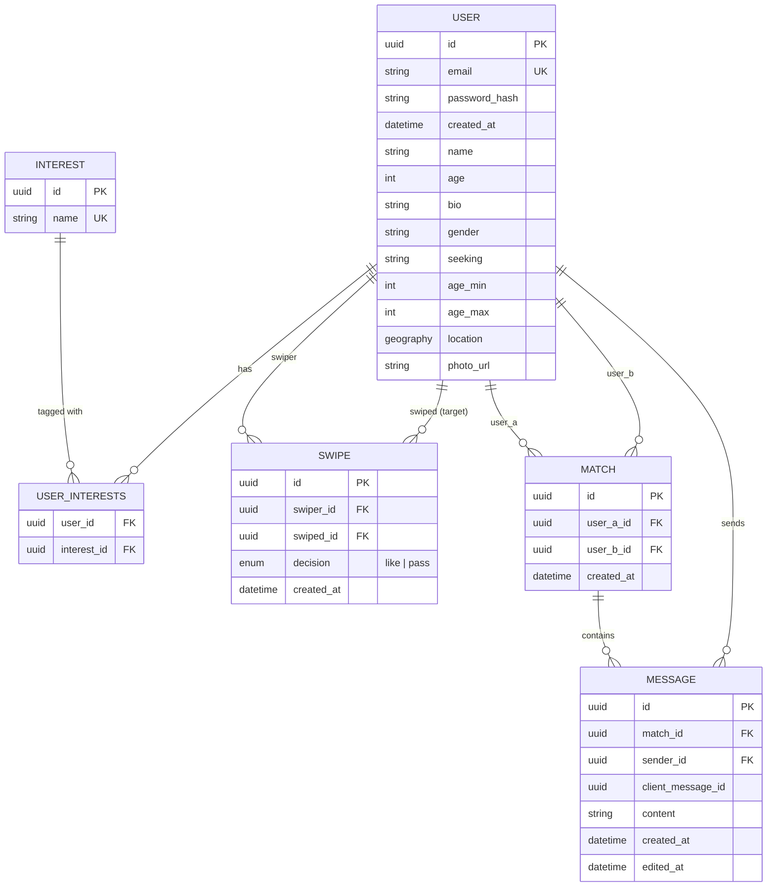

# Kpinder — Spec

Dating service MVP. Monorepo: `backend/` (Python, FastAPI) + `frontend/` (React, TypeScript, Vite).

## 1. Components

Backend is organized as **vertical slices** — one bounded context per feature, not horizontal layers spanning the whole app. A slice owns its router, service, repository, and (where applicable) its own tables. Slices never import another slice's router or service.

| Slice | Owns | Depends on |
|---|---|---|
| `auth` | signup, login, JWT issuance, profile update (incl. interest selection), photo upload | `shared` |
| `matching` | candidate feed, swipe, match detection, paginated match list | `shared` |
| `chat` | message CRUD (send/list/edit/delete), in-conversation search, live push over WebSocket | `shared` |

`shared/` (core) is not a slice — it's infrastructure every slice depends on, and never the other way around:
- DB session factory
- JWT-verify dependency (identifies the current user for any slice's router; a pure signature/expiry check, no DB access — ADR-0014)
- WebSocket connection registry (`user_id → connection`, in-memory, single-process)
- Core data models: `User`, `Interest`, `UserInterests`

A slice's own repository may read `shared`'s tables directly (e.g. `matching` reads `User`/`Interest` for candidate ranking) — that's reading shared data, not calling another slice's business logic, so it doesn't violate the no-cross-slice-import rule.

### Internal layering (per slice)

```
router.py       — HTTP/WS endpoints, Pydantic schemas
service.py       — business rules (scoring, match detection, event emission)
repository.py    — SQLAlchemy queries only, no business logic
models.py        — slice-owned tables (reads shared models directly where needed)
tests/           — unit tests (repository mocked) + integration tests (real DB)
```

### Cross-slice communication

There is no event bus and no message broker. `matching` and `chat` are the only slices with anything to push live, and each does so directly over the shared WS registry to the other user involved — `chat`'s REST endpoints (send/edit/delete) are the source of truth for message state, and after each one commits, `chat` separately pushes the same event (new/edited/deleted message) to the other side's WS connection if registered, purely as a live-UI convenience. Nothing is persisted and nothing is delivered after the fact: an offline user simply sees the current state next time they call `GET /chat/{match_id}/messages`. A dedicated `notifications` slice, a Redis pub/sub event bus (`match.created`/`message.sent`), and a candidate-list cache were all designed and then deliberately cut from this MVP — see `ai/audit.md` and `standards/adr/0003-redis-event-bus.md` for why, and what would need to change to bring them back.

## 2. Data model



Notes:
- `SWIPE` has a unique constraint on `(swiper_id, swiped_id)` and records both `like` and `pass`, so a passed profile never resurfaces in a future candidate list.
- `MATCH` is created the moment a reciprocal `like` is detected (both directions exist in `SWIPE`), and has an index on `created_at` for keyset pagination (ADR-0012).
- Location is stored as a PostGIS `geography(Point)` column; candidate queries filter with `ST_DWithin`.
- Interests are a curated, predefined tag list (not free text) so Jaccard overlap is meaningful — free text would make "hiking" and "hikeing" score as zero overlap.
- `MESSAGE` has a unique constraint on `(match_id, sender_id, client_message_id)` for send-retry dedup (§3), an index on `created_at` for keyset pagination (ADR-0012), and `edited_at` for the edit scenario (§3). Delete is a hard delete (ADR-0013) — no `deleted_at`/tombstone column; a deleted message's row is removed entirely.

## 3. Key scenarios — how data updates

### Signup & login (`auth`)
1. `POST /auth/signup` — validates input, hashes password, inserts a `User` row. Concurrent signups for the same email are handled by inserting and catching the `email` unique-constraint violation — not a check-then-insert — and returning `409 Conflict`. This is the same idiom used for swipe/match (below) and message dedup: let the DB's unique constraint be the single source of truth for "does this already exist," never a SELECT-then-INSERT with a TOCTOU gap.
2. `POST /auth/login` — verifies credentials, issues a JWT (single long-lived access token, no refresh rotation for MVP).
3. There is no `/auth/logout` endpoint and no server-side token revocation (ADR-0014) — a leaked or shared-device token remains valid until it naturally expires. "Logging out" is purely a frontend concern (the client discards its stored token); this isn't exposed as a backend endpoint since it isn't backend-meaningful (ADR-0014).
4. All other slices' routers depend on the shared JWT-verify dependency to identify the caller — a pure signature/expiry check, no DB access — none re-implement auth.

### Profile update & photo upload (`auth`)
1. `PATCH /auth/update_profile` — updates `User` fields (bio, location, gender/seeking, age range) and the caller's interest selection (replaces the `UserInterests` rows for that user with the submitted set, validated against the curated `Interest` table — an unrecognized interest name is rejected with `422`, not silently dropped or inserted as a new tag).
2. `POST /auth/upload_photo` — validates content-type/magic bytes and size, uploads to Cloudflare R2 under a randomized UUID object key (ADR-0010 — a local disk volume doesn't survive a Railway redeploy), stores the resulting object URL as `photo_url` on `User`. The MVP does not delete the previous photo object on re-upload (scoped out, §4).

### Feed, swipe & match (`matching`)
1. `GET /matching/feed` — a single query: `User` + `UserInterests` eager-loaded via `selectinload` (one batched follow-up query for interests, never one-per-candidate), filtered by PostGIS radius (`ST_DWithin`) + gender/seeking + age range, excluding the caller themselves and anyone already present in `SWIPE` via a `NOT EXISTS` subquery (not a separate "fetch swiped IDs, filter in Python" pass). Ranks the rest by Jaccard interest overlap, capped at a fixed page size (no cursor pagination on the feed itself — scoped out, §4).
2. `POST /matching/swipe` — inserts a `SWIPE` row (`like` or `pass`) inside one transaction, then checks for a reciprocal `like`; if found, inserts a `MATCH` row in the same transaction and pushes a live "match" update directly to both users over the shared WS registry, if connected.
   - **Append-only, no upsert**: `SWIPE` is never updated or deleted. There is no "unlike"/unmatch scenario — once a `MATCH` exists, it's permanent for this MVP (see §4). A later `POST /matching/swipe` for the same `(swiper_id, swiped_id)` pair with the **same** decision is treated as an idempotent retry: the insert hits the unique constraint, the resulting `IntegrityError` is caught, and the original result (200, including "matched": true/false) is returned rather than propagating a 500. The same request with a **different** decision than what's stored is rejected with `409 Conflict` — a client is never allowed to silently flip a past swipe.
   - **Concurrency**: two users liking each other within milliseconds of each other is the core race, resolved by insert-and-catch-unique-violation on the normalized `(user_a_id, user_b_id)` pair — see ADR-0009 for the full mechanism and why it was chosen over row-locking/`SERIALIZABLE`. Verified with an integration test that interleaves two real concurrent transactions against Postgres and asserts exactly one `MATCH` row results.
3. `GET /matching/matches` — the caller's matches, newest first, keyset-paginated 20 at a time (`?cursor={last_match_id or created_at}`, ADR-0012): the client passes the last item it saw and gets the next 20 strictly older, rather than an `OFFSET` that would skip/duplicate rows if a new match is created mid-scroll.

### Messages: send, list, edit, delete & search (`chat`)
1. `POST /chat/{match_id}/messages` — validates the sender is part of the `match`. The client includes a `client_message_id` (UUID, generated per send attempt); `MESSAGE` has a unique constraint on `(match_id, sender_id, client_message_id)`. A resend after a timed-out/un-acked send (same `client_message_id`) hits that constraint and is treated as a no-op — the server returns the original message instead of inserting a duplicate. On a fresh id, inserts a `Message` and pushes it directly to the recipient's connection over the shared WS registry if registered. If the recipient isn't connected, they see it next time they call the list endpoint below.
2. `GET /chat/{match_id}/messages` — that conversation's messages, newest first, keyset-paginated 20 at a time (same cursor mechanism as `GET /matching/matches`, ADR-0012) — a new incoming message mid-scroll never shifts already-fetched pages.
3. `PATCH /chat/messages/{message_id}` — edits a message's `content` and sets `edited_at`. Only the original sender may edit their own message (`403` otherwise); editing an already-deleted (i.e. no-longer-existing) message returns `404`. Pushes an "edited" event to the other side over WS if connected.
4. `DELETE /chat/messages/{message_id}` — hard-deletes the row (ADR-0013 — keyset pagination keys off `created_at`/id values on the *remaining* rows, so removing one doesn't shift anyone else's cursor; there was no pagination reason to keep a soft-delete tombstone, and no stated moderation/audit requirement to justify one either). Only the original sender may delete their own message (`403` otherwise); deleting an already-deleted (i.e. no-longer-existing) message returns `404` — repeating the request always ends with the resource absent. Pushes a "deleted" event to the other side over WS if connected — for anyone not connected at the time, the message is simply gone next time they fetch, with no trace it ever existed.
5. `GET /chat/{match_id}/messages/search?q=...` — filters that one conversation's messages by content; same authorization check as the list endpoint (caller must be part of the match).

### DB/source failure handling (all slices)
A Postgres connection drop or query failure (not a business-logic error like a duplicate email) is not retried automatically inside the request. The SQLAlchemy engine uses `pool_pre_ping` so dead pooled connections are detected and replaced before use rather than surfacing mid-query; a FastAPI exception handler catches `OperationalError`/`DisconnectionError` and returns a generic `503` (never leaking the underlying DB error to the client). There is no message queue to safely replay a side-effecting write, so the client — not the server — decides whether to retry; the idempotency rules above (unique-constraint-backed dedup for register/swipe/message) make any such client-initiated retry safe.

## 4. Scoped out (documented, not built)

- **Static-data prototype phase.** Lab-2's brief calls for implementing scenarios against static/in-memory data first, then swapping in the real DB. This project goes straight to DB integration (SQLAlchemy + Postgres+PostGIS from the start) instead — a deliberate, documented scope cut given the lab's timeline, not an oversight. See `ai/audit.md` Part A.
- **Unmatching / un-liking.** `SWIPE` is append-only (see §3); there is no endpoint or business rule that deletes a `MATCH` once created, and no way to retract a `like`.
- Frontend tests (Vitest/RTL) — backend-only test coverage for this lab.
- JWT refresh-token rotation, logout, and any server-side revocation mechanism — single long-lived access token, valid until natural expiry, no way to force-invalidate it early (ADR-0007, ADR-0014).
- Multi-instance WebSocket scaling — connection registry is single-process.
- Rate limiting / abuse prevention.
- `notifications` slice, persisted/offline notifications, and any event bus or message broker (Redis or otherwise) — `matching`/`chat` push live over the shared WS registry only; nothing is queued, persisted, or delivered to an offline user. See `ai/audit.md` for the fuller design this replaced and why it was cut.
- Candidate-list caching — `matching` queries Postgres directly on every request; no cache layer.
- Cursor/offset pagination beyond a fixed page size on `GET /matching/feed` — a fixed `LIMIT` (top ~20-50 by score), not full pagination; unlike matches/messages, the feed isn't a stable list a user scrolls back through.
- Email verification on signup — an account is active immediately after `POST /auth/signup`.
- Password complexity rules beyond a minimum length — no uppercase/symbol/entropy requirements enforced.
- Content moderation / profanity filtering on messages — only a generous max-length cap is enforced.
- Old-photo cleanup on re-upload — `POST /auth/upload_photo` overwrites `photo_url`; the previous R2 object is not deleted.

## 5. Infra & environments

- **Local**: `docker compose up` — Postgres+PostGIS, backend, frontend.
- **CI**: GitHub Actions — `ruff`/`eslint`+`prettier`, backend unit tests, integration tests (real Postgres+PostGIS via testcontainers), frontend build. All required checks on every PR into `main`.
- **Staging**: Railway, auto-deploys on every merge to `main`.
- **Config**: `pydantic-settings` reads env vars uniformly across local/stage/prod; secrets (DB URL, JWT signing key, Cloudflare R2 account ID/access key/bucket — ADR-0010) are never committed — `.env.example` only.

## 6. Testing strategy

Four tiers, each with a distinct mechanical definition (not just a scope difference):

| Tier | Mechanics | Real deps used |
|---|---|---|
| Unit | Repository mocked, service layer tested in isolation | None |
| Integration | `httpx` `ASGITransport` in-process against the FastAPI app; WS via `TestClient.websocket_connect` | Real Postgres+PostGIS (testcontainers) |
| E2E | Real running server (`docker compose`: backend container + Postgres), driven over actual HTTP/WS from outside (`websockets` client for WS) | Everything — real process, real network |

- `matching/service.py` (swipe→match: append-only retry handling, insert-and-catch race resolution, Jaccard scoring) is the module targeted for full unit-test branch coverage — the richest conditional logic in the spec, and the one mutation testing is scoped to (ADR-0015).
- E2E, API-level, full cross-slice journeys (signup → login → update profile → swipe both ways → match → send/edit/delete a message) — not browser automation, since there's no frontend yet (ADR-0016).
- Mutation testing: `mutmut` (ADR-0015), run manually via `make mutation`, not a CI gate (ADR-0018). The surviving-mutant report classifies each survivor as a real test gap / an equivalent mutant / an acceptable gap, and feeds directly into the audit step (top-3 places the green suite doesn't catch a real bug) and `DEFENSE.md`.
- See ADR-0017 for why integration and E2E differ mechanically, not just in scope, and ADR-0019 for the WS-specific tooling split.

This section documents tooling/strategy decisions only — none of this has been implemented yet; actual test-writing follows once lab-2's scenarios (§3) are built (see `ai/prompts/`).

## 7. Standards

See `standards/` for ADR format (MADR), Definition of Done, and the audit checklist. ADRs are written only for genuinely contested decisions (vertical slices vs layered, shared-core boundary rule, Redis as event bus, WebSockets vs polling, PostGIS vs plain lat/lng, swipe+mutual-match vs auto-match, JWT vs sessions) — not for routine stack picks.

## 8. AI trail

This spec was shaped through an AI-assisted design interview. The full prompt trail is in [`ai/prompts/`](ai/prompts/), and a self-audit of where the AI's suggestions cut corners (and were corrected) is in [`ai/audit.md`](ai/audit.md) — each entry links the originating prompt, the human's correction, and the resulting change to this spec.
